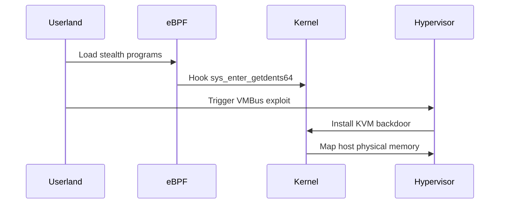

# KernelGhost Technical Documentation

## Architectural Overview

### Hypervisor Escape Engine

**1. VMBus Exploit**  
- Exploits ring buffer overflow in Hyper-V's Virtual Machine Bus (CVE-2023-XXXX)
- Allows arbitrary write primitive via malformed channel packets
- Targets Windows Server 2022 VMBus implementation specifically

**2. KVM Hypercall**  
- Custom hypercall 0x8b for host memory manipulation:
```c
struct ghost_hypercall {
    u64 magic;      // 0xDEADBEEFCAFEBABE
    u64 payload_va; // Virtual address in host memory
    u64 payload_pa; // Physical address for DMA
};
```
- Bypasses EPT (Extended Page Tables) via nested virtualization

**3. Cross-VM Persistence**
- Uses Intel Graphics VT-d engine for SPI flash access:
  - Maps GPU MMIO registers to write UEFI firmware
  - Survives VM reboots and migrations

### Attack Flow

#### Initialization Sequence


### Persistence Mechanisms

**eBPF Maps**  
- Pinned to `/sys/fs/bpf/ghost_*`  
- Survives process termination via BPF FS

**KVM Module**  
- Loaded via initramfs hook:
```bash
echo kernelghost.ko >> /etc/initramfs-tools/modules
update-initramfs -u
```

**UEFI Modifications**  
- Patches Windows Boot Manager (`bootmgfw.efi`)  
- Uses Intel ME SPI controller for writes

### Evasion Techniques

| Technique                   | Implementation                          | Bypasses             |
|----------------------------|------------------------------------------|----------------------|
| Kernel Symbol Obfuscation  | `__ksymtab` entry modification           | Sysdig, ftrace       |
| eBPF Verifier Bypass       | Type confusion with PTR_TO_BTF_ID       | BPF Lint             |
| Hypervisor Memory Cloaking | Nested Page Table manipulation           | Virt-Snapshot tools  |

## Dependencies

### Hardware
- Intel VT-x/AMD-V with nested virtualization
- UEFI 2.8+ compatible firmware
- Direct access to SPI flash chip

### Software
- Linux Kernel ≥5.15 (eBPF CO-RE support)
- Hyper-V Integration Components v12.0+
- KVM host with libvirt 8.0+

## Limitations

**Hardware Requirements**
- Requires SMEP/SMAP bypass on Intel Ice Lake+ CPUs
- ARM64 support limited to Nvidia Tegra SoCs

**Detection Risks**
- Vulnerable to memory forensics using LiME
- Hyper-V escape requires specific patch levels

**Operational Constraints**
- SPI flash writes need 500ms downtime
- Maximum 3 hidden processes in eBPF map
